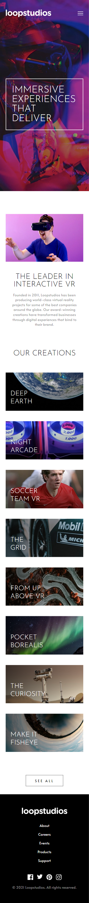
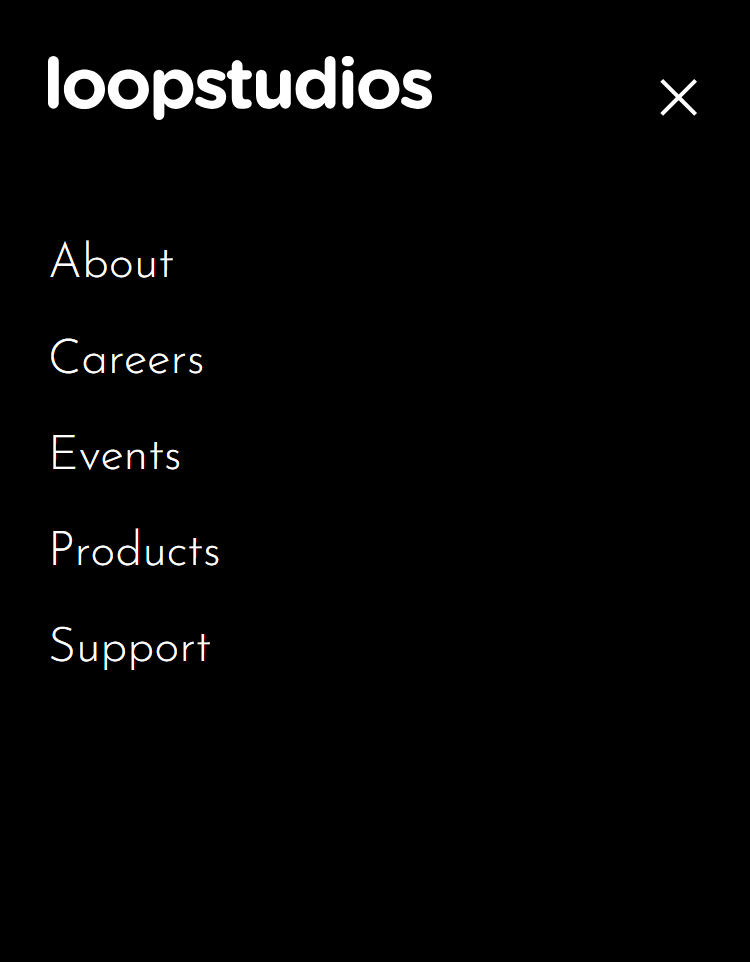

# Frontend Mentor - Loopstudios landing page solution

This is a solution to the [Loopstudios landing page challenge on Frontend Mentor](https://www.frontendmentor.io/challenges/loopstudios-landing-page-N88J5Onjw). Frontend Mentor challenges help you improve your coding skills by building realistic projects. 

## Table of contents

- [Overview](#overview)
  - [The challenge](#the-challenge)
  - [Screenshot](#screenshot)
  - [Links](#links)
- [My process](#my-process)
  - [Built with](#built-with)
  - [What I learned](#what-i-learned)
  - [Useful resources](#useful-resources)
- [Author](#author)

## Overview

### The challenge

Users should be able to:

- View the optimal layout for the site depending on their device's screen size
- See hover states for all interactive elements on the page

### Screenshot






- Mobile version screenshot for 375px
- Mobile burger menu active
- Desktop version screenshot for 1440px


### Links

- Live Site URL: [Add live site URL here](https://your-live-site-url.com)

## My process

### Built with

- Semantic HTML5 markup
- CSS custom properties
- Flexbox
- CSS Grid
- Mobile-first workflow
- Javascript
- DOM

### What I learned

- To work with grids efficiently
- To combine grids with flex boxes
- Use vh on the images
- Use of pseudo-elements (::after and ::before)
- Creating visually appealing hover effects on interactive elements

```css
/* How to make an overlay */
.section-1 {
        display: grid;
        grid-template-columns: repeat(3, 1fr);
    }

    .image-interactive {
        background-image: url("images/desktop/image-interactive.jpg");
        height: 50vh;
        background-size: contain;
        grid-area: 1 / 1 / span 3 / span 3;
    }

    .section-1 .text-interactive {
        background-color: white;
        grid-area: 2 / 2 / span 2 / span 2;
    }

    /* Hover effect on links */

    a {
      position: relative;
    }

    a::before,
    a::after {
        content: "";
        position: absolute;
        bottom: -8px;
        left: 50%;
        width: 0;
        height: 2px;
        background-color: white;
        transition: width 0.3s ease, left 0.3s ease;
    } 

    a::before {
        transform: translateX(50%);
    }

    a::after {
        transform: translateX(50%);
    }

    a:hover::before,
    a:hover::after {
        width: 50%;
        left: 0;
    }

    /* Hover effect on images */

    .images-default::after {
        content: '';
        position: absolute;
        top: 0;
        left: 0;
        width: 100%;
        height: 100%; 
        background: rgba(255, 255, 255, 0);
        transition: background-color 0.3s ease;
    }

    .images-default:hover::after {
        background-color: rgba(255, 255, 255, 0.75);
    }
```

### Useful resources

- [W3school how to make menu icon](https://www.w3schools.com/howto/howto_css_menu_icon.asp) - Nice way to make animated menu icon.

- [W3school how to make overlay nav](https://www.w3schools.com/howto/tryit.asp?filename=tryhow_js_overlay) - Nice way to make navigation overlay.

## Author

- Linkedin - [Nika Merabishvili](https://www.linkedin.com/in/nikusha-merabishvili/)
